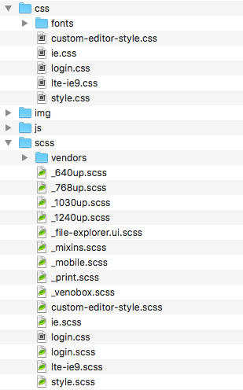

# SASS

- SOLO
- duration: `1 day`
- repository: `learning-sass`

## Learning Objectives

 - understand the added value of using SASS to write your CSS code
 - have a first hands-on experience at writing SASS

## Introduction

The SASS (file extension: scss) is a *frontend* development tool, which generates css from a language similar to CSS, but with powerful features. By writing your stylesheets in sass rather than directly in CSS, you get nice stuff that can **decrease your working time** (your Labor Union will be happy), make your **code more reusable** from one project to another (your boss will be happy), more readable too, thanks to improved syntax, including **functions** (called "mixin" in the sass world) and **variables**.

## Let's start

- [SASS Presentation](https://docs.google.com/presentation/d/1GFK1HjajFu8Hc3rLt9iIiv9hrgcVEEvTnFQmEporFxk/edit#slide=id.g35ed75ccf_057)

- official site: http://sass-lang.com

## Setup

To be able to write SASS code, you need software that runs on your development machine, and that will "watch" the SASS files. Whenever the sass file  is saved, the corresponding CSS file will be generated again.

Here are some Desktop applications you can use to process SASS (free and paid): http://sass-lang.com/install

## Ready, Steady, Go !

- Create the repository: `learning-sass`
- Create a basic html file :  `index.html`, just so we have something to play with.
- Create a folder and call it `assets` : it will contain all static files necessary for the visual look of the interface you are going to create. Images, css, javascript, fonts ... And Sass files (which, weirdly use the `.scss` extension). Inside this folder, create another one for each type, so as to look like this:

   

-  This "assets" folder structure has become a form of convention among frontend developers. Of course, it's up to you to get away from it, if you like reinventing the wheel.

- Create a `assets/scss/style.scss` file and configure your sass application to generate the `assets/css/style.css` file each time the "source" file (style.scss) is modified.
- Make sure that your html file contains a `<link rel="stylesheet" ... >` refering to your.css file (and not to the.scss file).
- Experiment with these [exercises in basic SASS features](https://gist.github.com/pixeline/dab8a29566b994453b8c681ed2b7ff2a)

### Project

- Re-use "First Sprint Turlutut or Active Collab" project : create a branch with a descriptive name, like: `convert-to-sass`.
- convert the project so that all css is generated from an scss file.
- try to use many sass features: variables, nesting selectors, invisible code comments... For instance :

    - modularize your scss code using *partial* files, to isolate code you could reuse in another project
    - if you have used the same value more than once, make it a variable
    - if you have complex selectors, use nesting
    - if you use rounded values (e. g. `width: 33%`) use the mathematical formula ( `width: (100/3)*1% ; `)
    - browse this [list of mixins](http://gillesbertaux.com/andy/doc/#mixin-prefix) and use those related to your code

- Finished? Merge the branch into the master and give yourself a big warm hug.

## Conclusion

At this point, you should have felt the added value of writing your CSS code using SASS.  From today on, we wish you to use SASS for every project because we want to see smiles on your face. Not like this guy :

